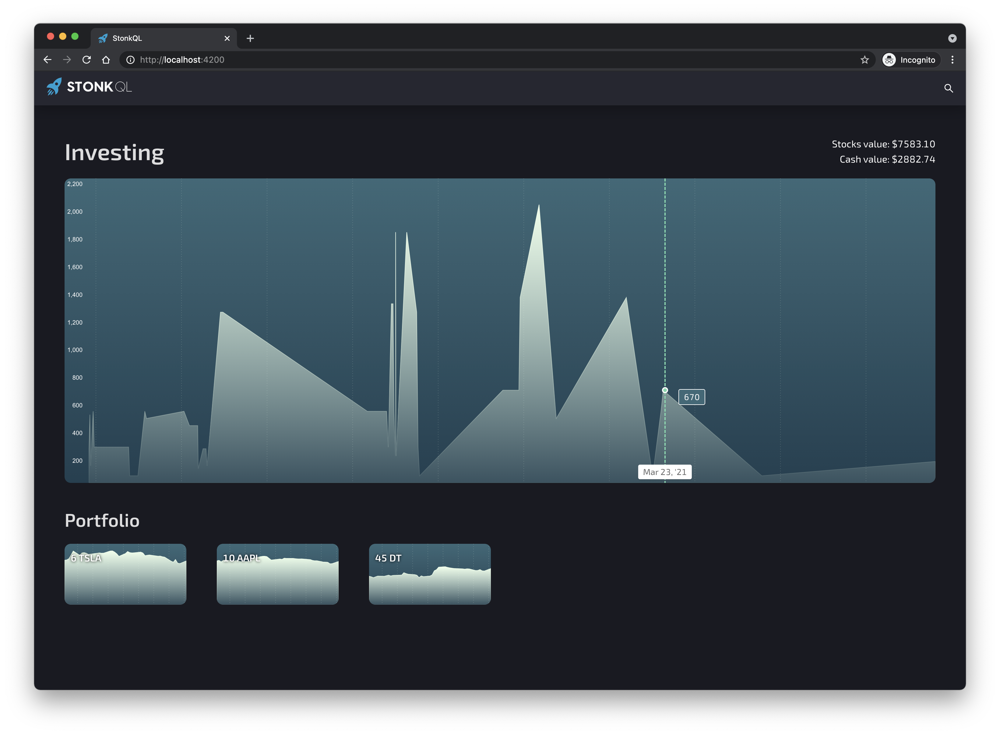
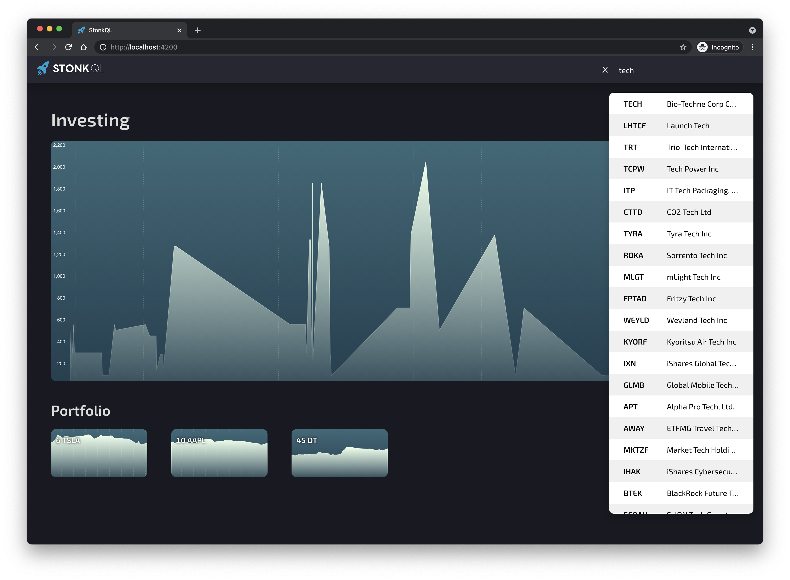
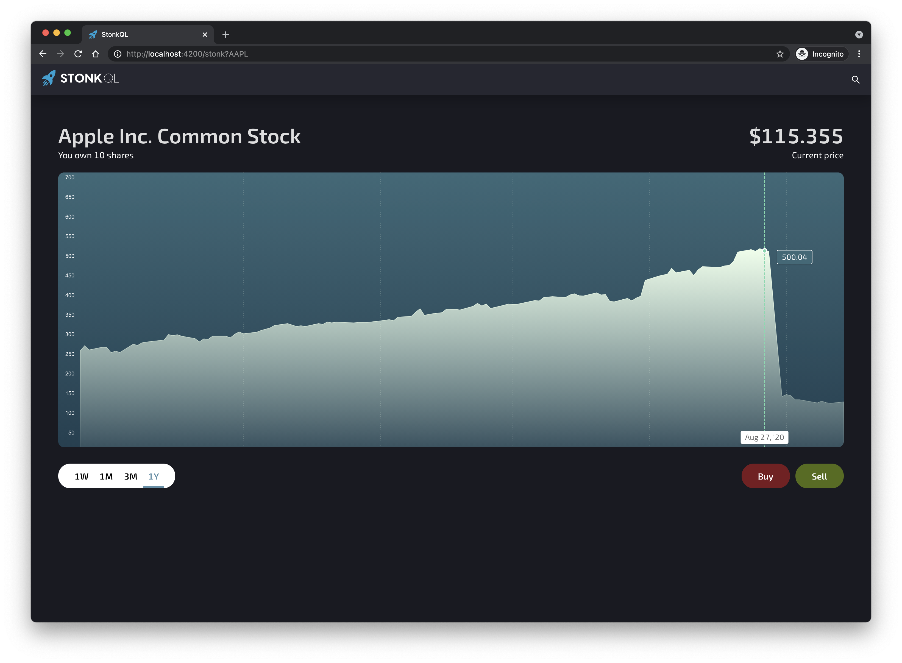
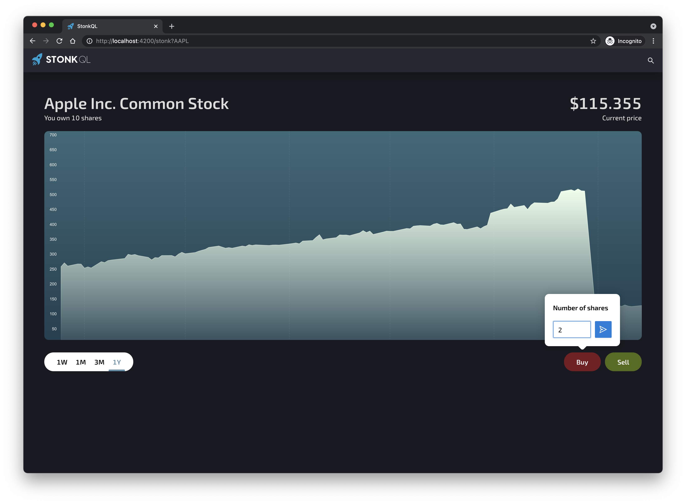
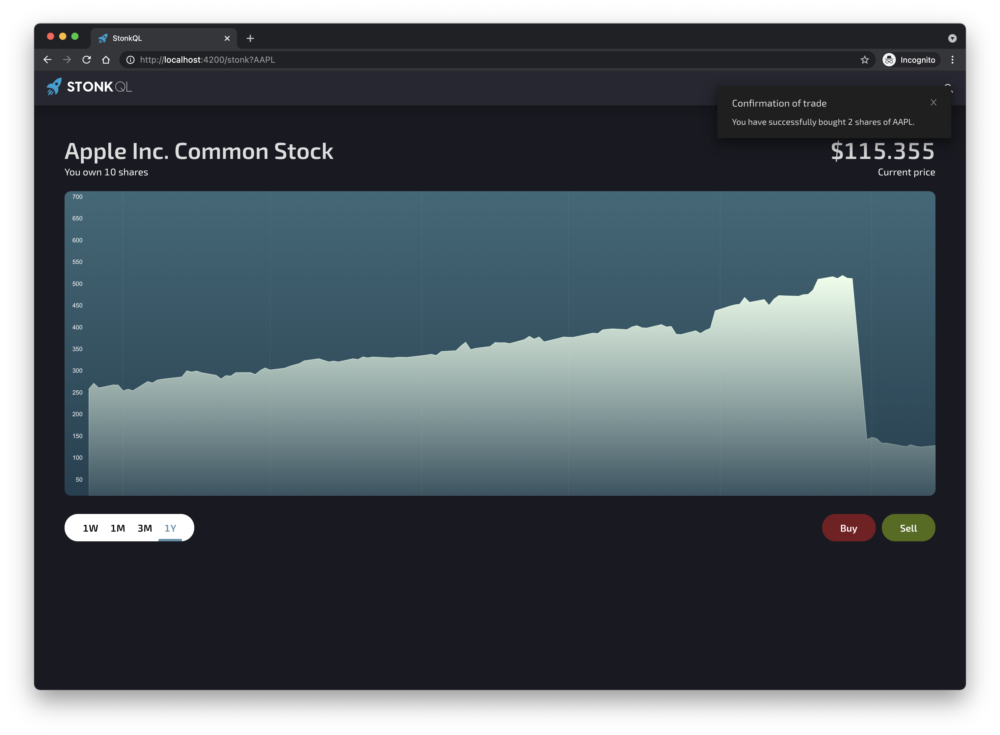

# StonkQL

StonkQL was developed by the StonkSquuad as a 24 hour Dynatrace Innovation day project. The goal for the team was to learn how to use GraphQL and the visx React visualization library from AirBnb in a fullstack application. The financial metrics are pulled from the [Polygon.io](https://polygon.io) stock API.

Why? Because we like the stock 🚀

### Features include:

- Search for stock by symbol or company name
- Buy or sell stock with simulated account
- List portfolio items and aggregated view of investments

### Team members:

- [@areknow](https://github.com/areknow)
- [@cmp11290](https://github.com/cmp11290)
- [@josecolella](https://github.com/josecolella)

